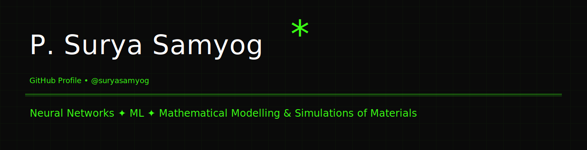
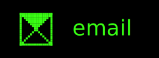
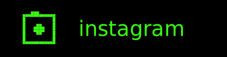
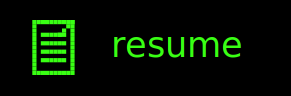
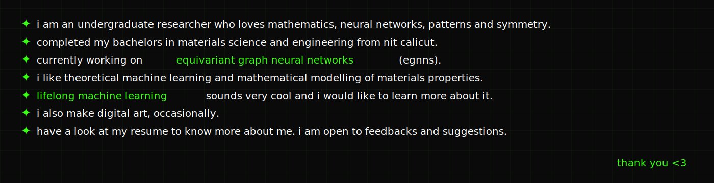
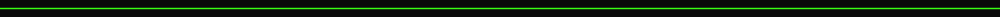

  

  
  &nbsp;&nbsp;&nbsp;
  
  &nbsp;&nbsp;&nbsp;
  

  

  

  

  

](https://<your-deploy-url>.vercel.app/api?username=suryasamyog&show_icons=true&theme=surya_theme&font=Fira+Code&hide_border=true
)

